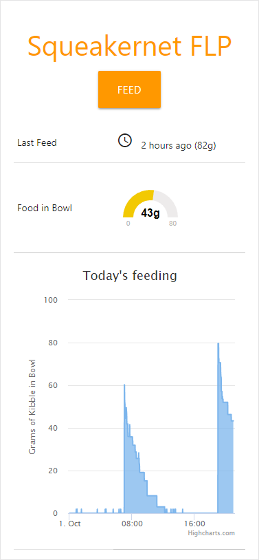

## SqueakerNet FLP
#### The Ultimate Feline Lifestyle Platform

Squeakernet creates an immersive feeding experience for cats and other mammals.

#### Current Features

- Dispenses cat food on a schedule
- Hosts a web server with remote feed, stats, logs and a feeding chart
- Weighs the cat's bowl to measure food dispensed and monitor feeding habits
- Uses an audio system to praise and encourage the cats during meal time.



#### Latest Progress Videos
- [New audio system alerts cats to impending feed, praises kitties](https://youtu.be/5Koy1ZGwy_Q)
- [New chute controls kibble flow](https://www.instagram.com/p/BmBhocHgJdD/)
- [Actually feeding the cat (pre-chute, messy)](https://www.instagram.com/p/Bl_AyjBFyaL/)
- [Experimental LED Display (discontinued)](https://youtu.be/koqxneu9SLM)
- [Breadboarded: push button, turn crank](https://youtu.be/f9sUizPjpKM)

#### Upcoming Features
- Email/text me an alarm when the hopper is empty
- Tweet about the cats dietary habits each day

#### Setup Instructions
1. Install required stuff:
```
  sudo apt-get install libttspico-utils

  pip install wiringpi
  pip install RPi.GPIO
  pip install bottle
  pip install psutil
```

2. Adjust squeakernet.ini for your rig.
3. Configure cronjobs for the web server and scheduled feeding. example:
```
# take weight reading once a minute, offset 30 seconds to avoid feed time
* * * * * ( sleep 30 ; python /share/squeakernet/squeakernet.py logweight )

# morning feed at 7:00am
0 7 * * * python /share/squeakernet/squeakernet.py feed

# evening feed at 7:00pm
0 19 * * * python /share/squeakernet/squeakernet.py feed

# log startup, start the web server on boot
@reboot python /share/squeakernet/squeakernet.py writelog 'Squeakernet was rebooted.'
@reboot python /share/squeakernet/squeakernet_web.py
```

```
    .       .         
    \`-"'"-'/
     } 6 6 {    
    =.  Y  ,=   
      /^^^\  .
     /     \  )           
jgs (  )-(  )/ 
     ""   ""

dedicated to mr. squeakers, r.i.p.
```
